# SQL (Structured Query Language)

## DDL (Data Definition Language) 
- CREATE TABLE;
- ALTER TABLE; 
- DROP TABLE
## DML (Data Manipulation Language) 
- INSERT; 
- DELETE; 
- UPDATE;
## DQL (Data Query Language) 
- SELECT;
## DCL (Data Control Language) 
- CREAT USER;
- ALTER;
## DTL (Data Transaction Language) 
- BEGIN TRANSACTION; 
- COMMIT; 
- ROLLBACK;

## Soluções dos Exercicios
[Site utilizado para as consultas ](https://sqliteonline.com/)

1) Realizar uma consulta que conte o número de registros na tabela.

    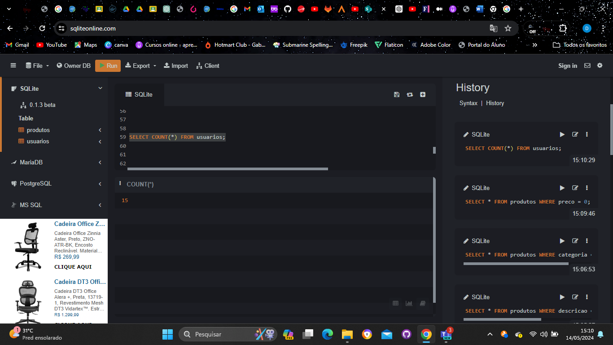

2) Realizar uma consulta para encontrar o usuário com o id 10.

    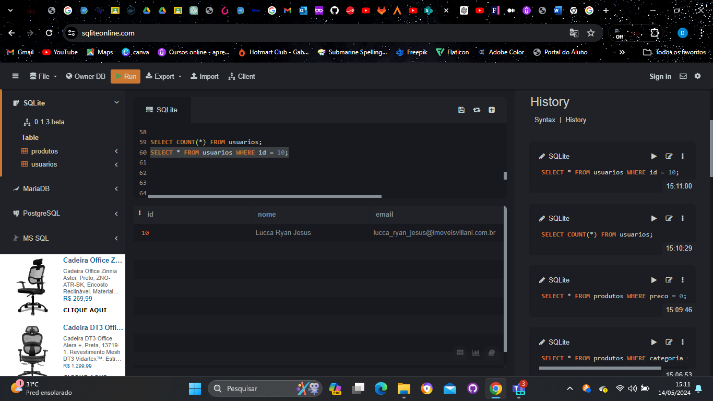

3) Realizar uma consulta para encontrar o usuário com o nome "Bruce Wayne".

    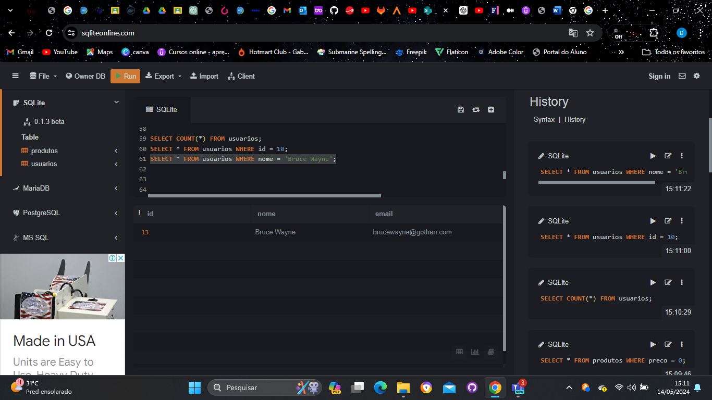

4) Realizar uma consulta para encontrar o usuário com o e-mail "ghost_silva@fantasma.com".

    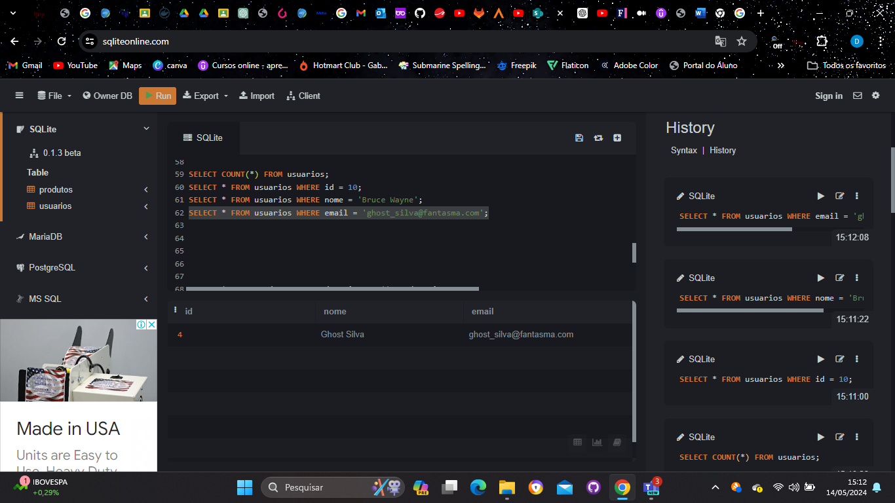

5) Realizar uma consulta para deletar o usuário com e-mail "peterparker@marvel.com".
Verificando se o email de usuario existe.

    

Deletando o usuario.

    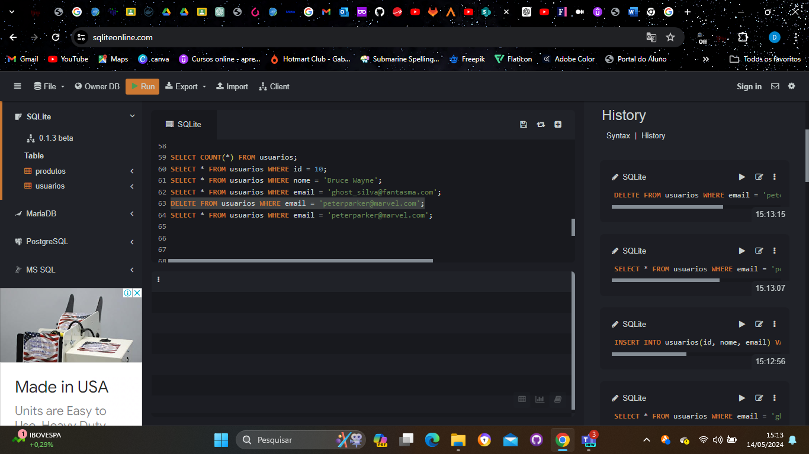

Confirmando se foi deletado.

    

Com base na tabela de Produtos.

1) Realizar uma consulta que apresente produtos com descrição vazia;

    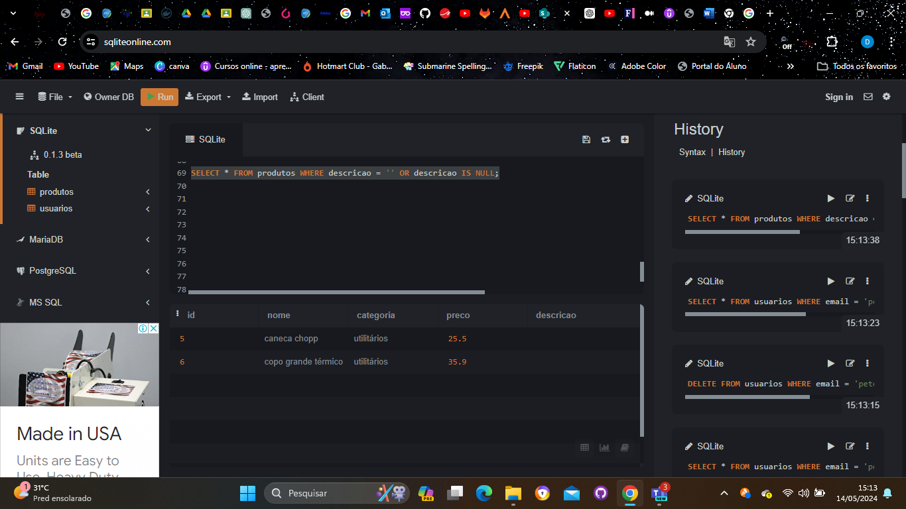

2) Realizar uma consulta que apresente produtos com a categoria "games";

    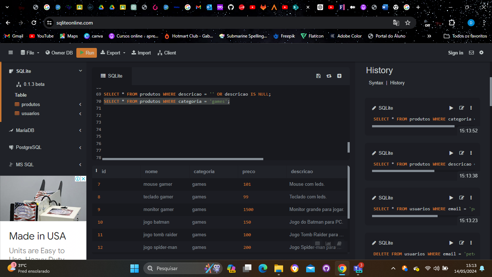

3) Realizar uma consulta que apresente produtos com preço "0";

    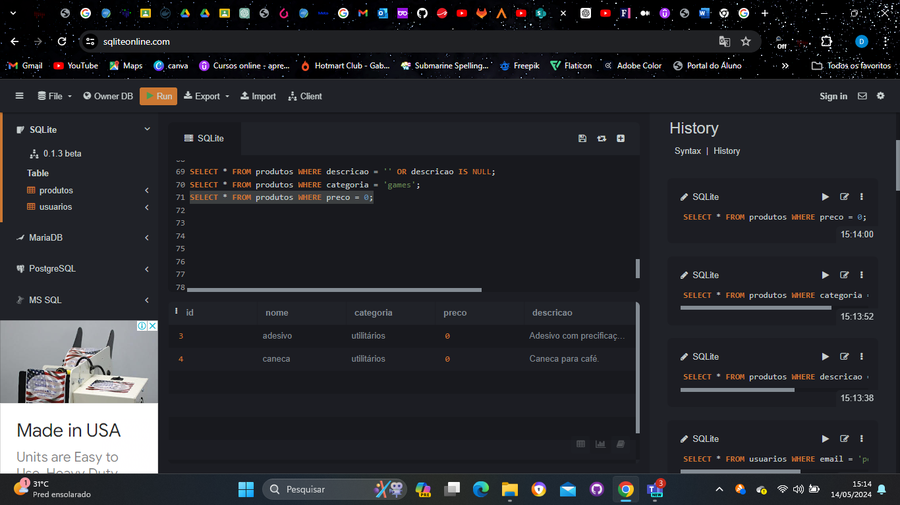

4) Realizar uma consulta que apresente produtos com o preço maior que "100.00";

    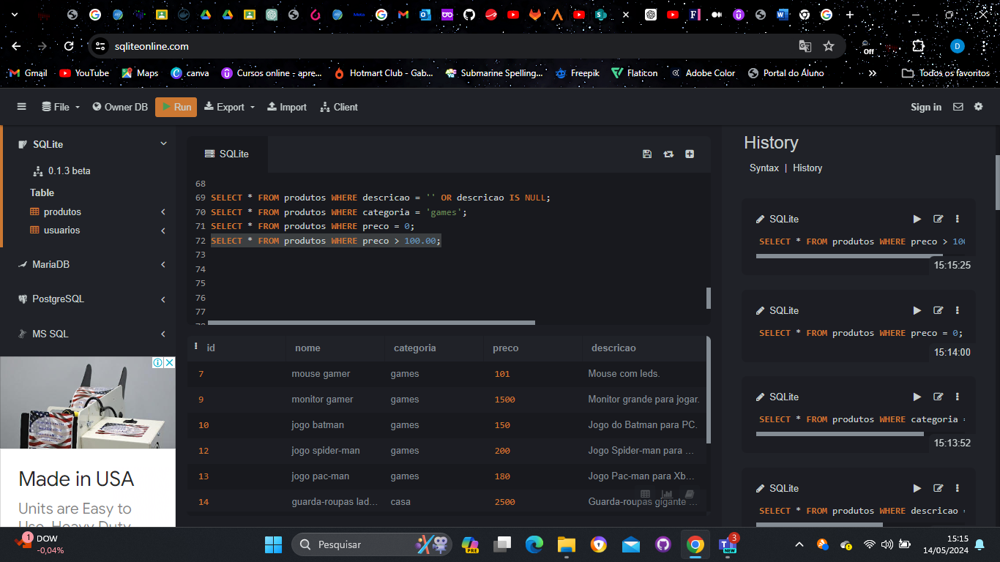

5) Realizar uma consulta que apresente produtos com o preço entre "1000.00" e "2000.00";

    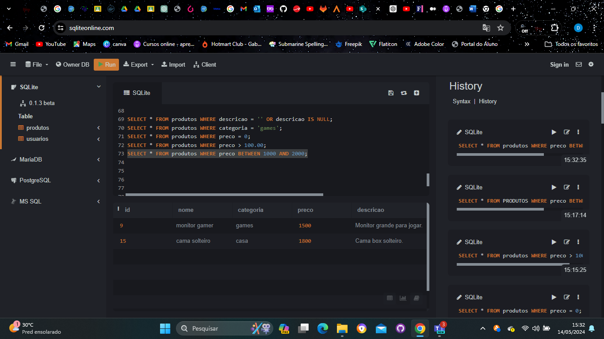

6) Realizar uma consulta que apresente produtos em que o nome contenha a palavra "jogo";

    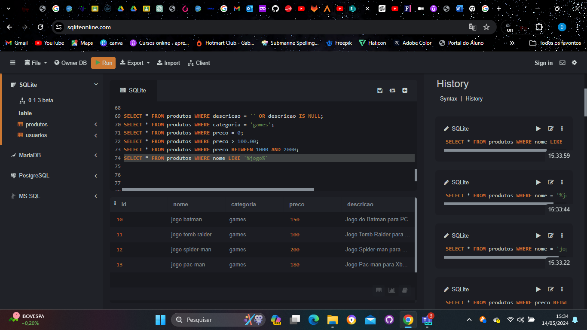

