# NoSql
## Comandos Mais Utilizados no MongoDB:
Inserção de Dados:

- db.collection.insertOne(): Insere um único documento na coleção.
- db.collection.insertMany(): Insere vários documentos na coleção.

Consulta de Dados:

- db.collection.find(): Recupera documentos que correspondem a um critério de filtro.
- db.collection.aggregate(): Executa operações de agregação, como agrupamento e agregação de dados.

Atualização de Dados:

- db.collection.updateOne(): Atualiza um único documento na coleção.
- db.collection.updateMany(): Atualiza vários documentos na coleção.

Exclusão de Dados:

- db.collection.deleteOne(): Exclui um único documento na coleção.
- db.collection.deleteMany(): Exclui vários documentos na coleção.

Indexação:

- db.collection.createIndex(): Cria índices para melhorar o desempenho de consultas.

Gerenciamento de Banco de Dados:

- show dbs: Lista todos os bancos de dados disponíveis.
- use <database>: Seleciona um banco de dados específico para uso.
- db.dropDatabase(): Exclui o banco de dados selecionado.

## Soluções dos Exercicios
[Site utilizado para as consultas ](https://www.humongous.io/app/playground/mongodb/new)

Com base no arquivo Json usuários:

1) Realizar uma consulta que conte o número de registros existentes.

    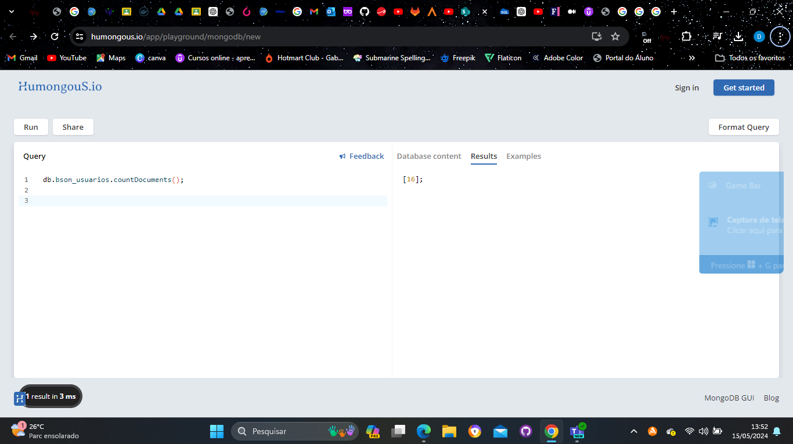

2) Realizar uma consulta para alterar o usuário com o nome "Teste Start" para "Teste Finish".

    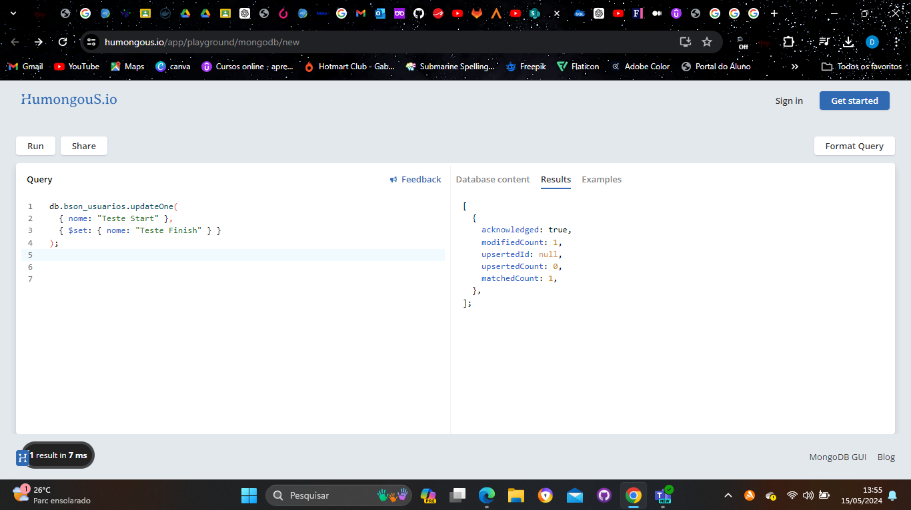

3) Realizar uma consulta para encontrar o usuário com o nome "Bruce Wayne".

    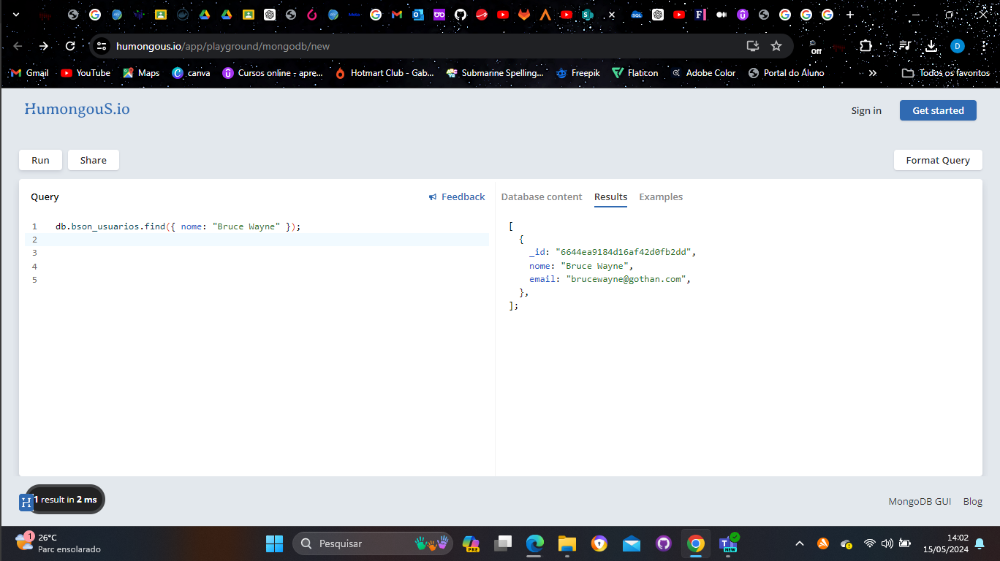

4) Realizar uma consulta para encontrar o usuário com o e-mail "ghost_silva@fantasma.com".

    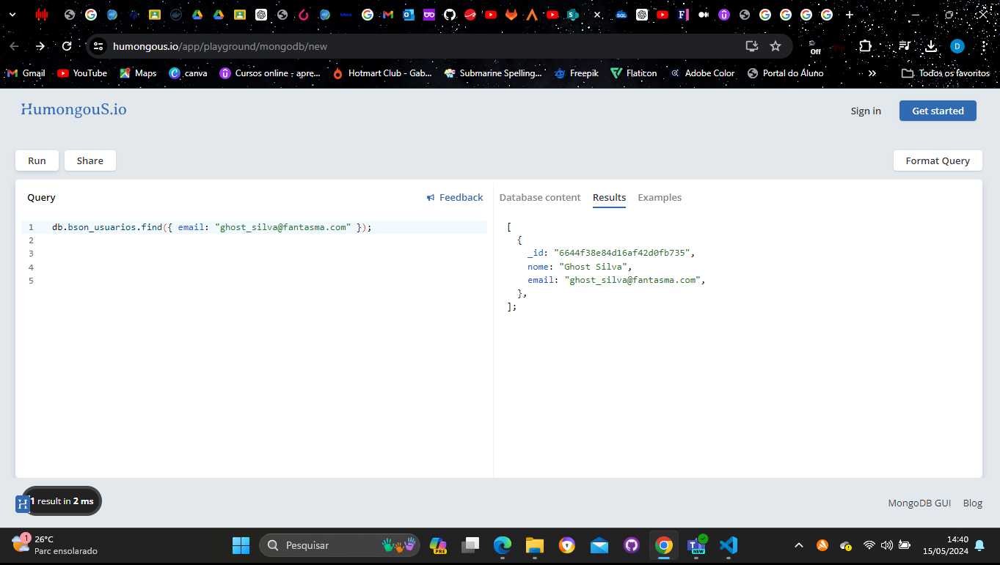

5) Realizar uma consulta para deletar o usuário com e-mail "peterparker@marvel.com".

    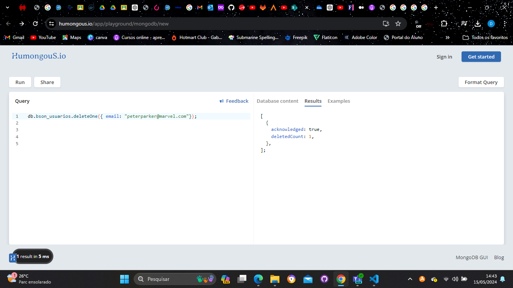

Com base no arquivo Json produtos:
1) Realizar uma consulta que apresente produtos com descrição vazia;

    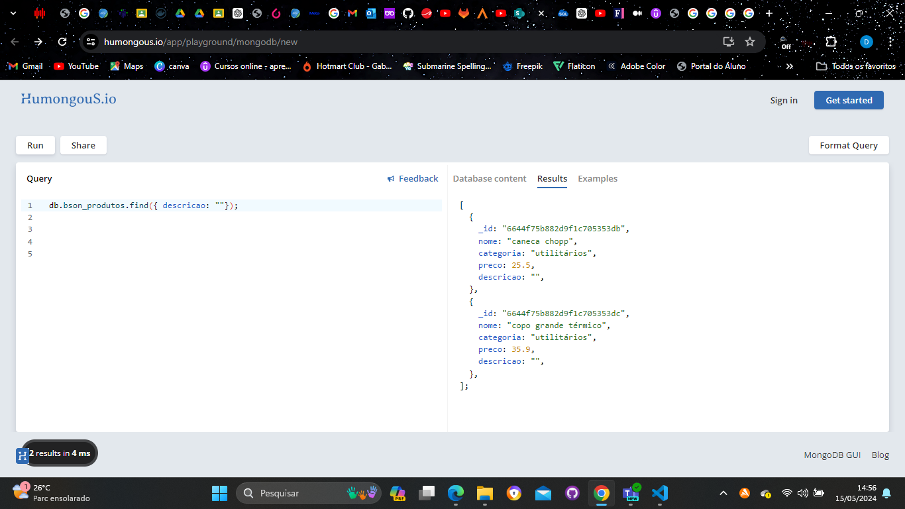

2) Realizar uma consulta que apresente produtos com a categoria "games";

    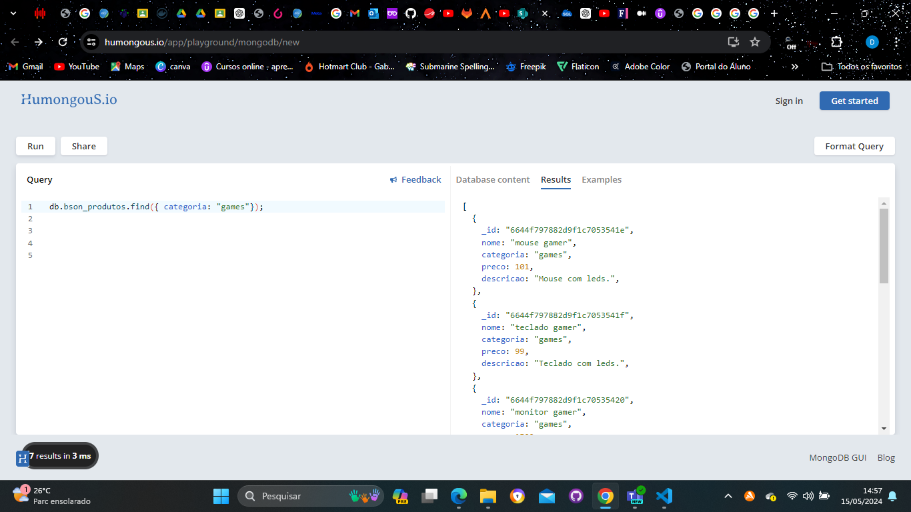

3) Realizar uma consulta que apresente produtos com preço "0";

    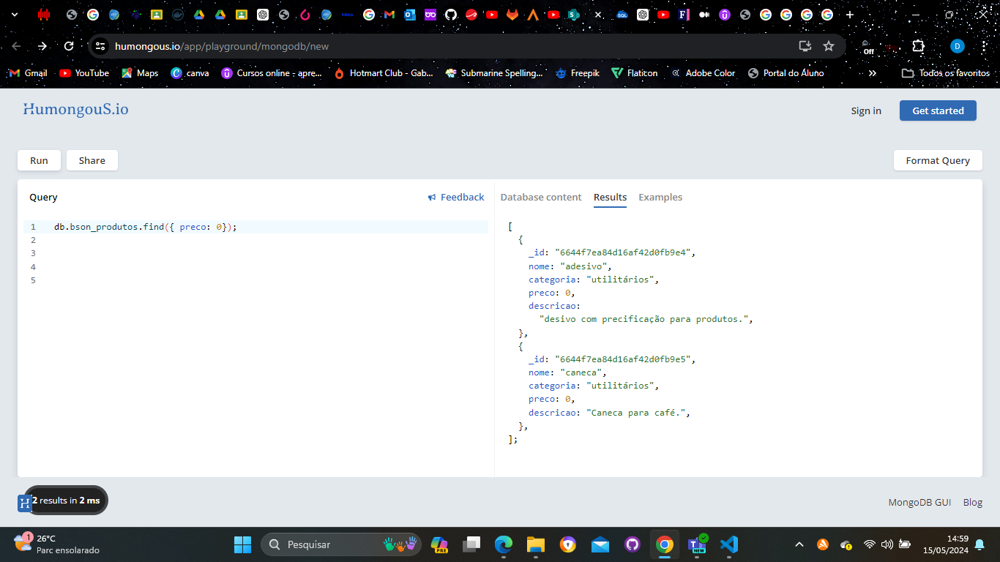

4) Realizar uma consulta que apresente produtos com o preço maior que "100.00";

    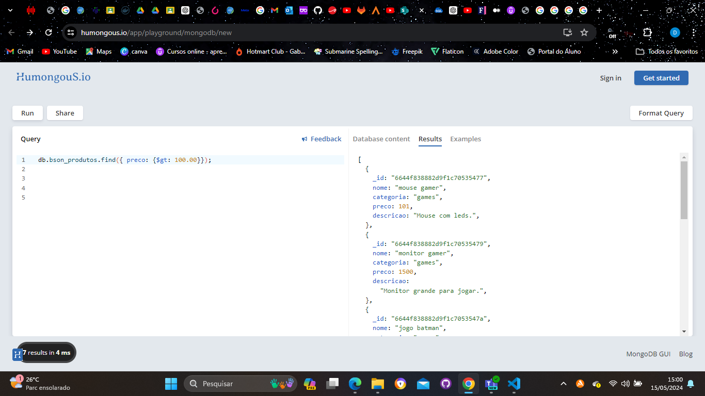

5) Realizar uma consulta que apresente produtos com o preço entre "1000.00" e "2000.00";

    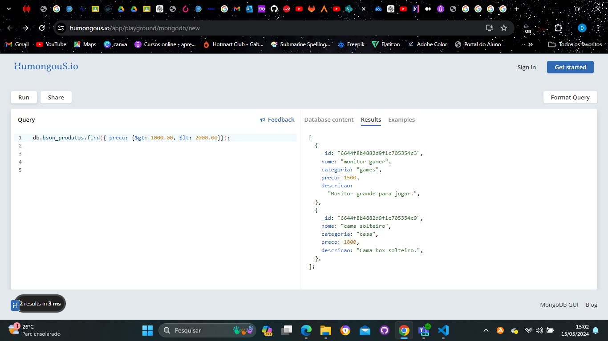

6) Realizar uma consulta que apresente produtos em que o nome contenha a palavra "jogo".

    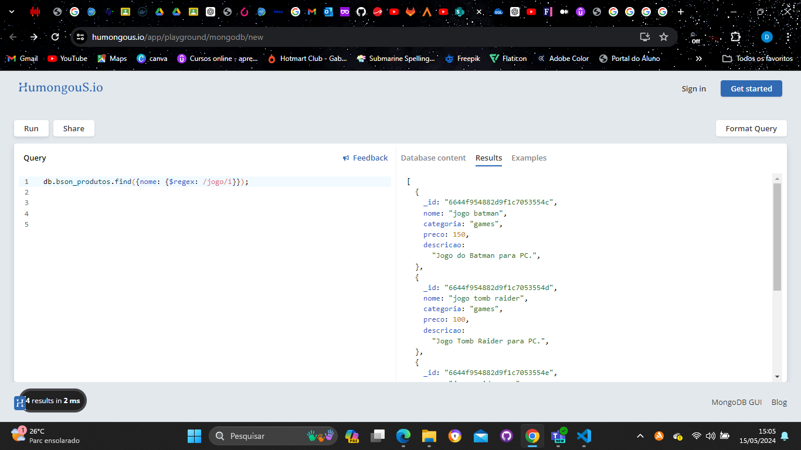

