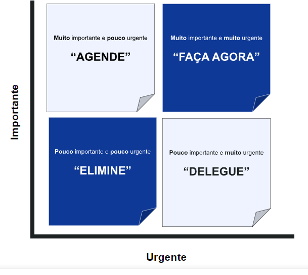

# Pontos importantes

## Matriz de Eisenhower 

E uma ferramenta de gestão de tempo composta por quatro quadrantes onde: 
- tarefas urgentes e importantes devem ser realizadas imediatamente, 
- tarefas importantes e não urgentes devem ser agendadas, 
- tarefas urgentes, mas não importantes pedemser delegadas e 
- tarefas nem urgentes nem importantes devem ser eliminadas.

    

## Comandos Git e Gitlab

- git init inicia um novo repositorio
- git add adiciona arquivo ao índice de mudanças
- git commit confirma mudanças no repositorio local
- git push envia as alterações para o repositorio remoto
- git clone clona um repositorio