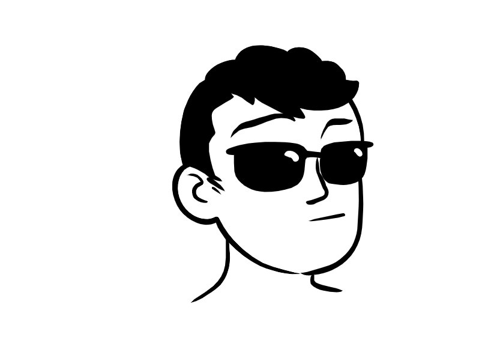

# Testes estáticos

# Swagger

Swagger é uma forma online de documentação, descrever e projetar API RESTful de maneira mais visualmente mais atrativa, que é escrita em um formato YAML, e contendo os métodos, endpoints, informações dos parâmetros, respostas. E
ele permite edição em tempo real.

# DiceBear Avatars API
## Descrição Geral:
- A DiceBear Avatars API permite a geração de avatares personalizados com base em strings de texto, como nomes, fornecendo uma ampla variedade de estilos e opções de personalização. Esses avatares podem ser integrados em projetos web facilmente através de URLs geradas.

URL Base da API:
https://www.dicebear.com/

## Utilização:
Para gerar um avatar, construa uma URL seguindo o formato abaixo, onde você substitui <styleName> pelo estilo de avatar desejado e adiciona parâmetros para personalizar o avatar conforme necessário.

# Styles:
Adventurer, Adventurer Neutral, Avataaars, Avataaars Neutral, Big Ears, Big Ears Neutral, Big Smile, Bottts, Bottts Neutral, Croodles, Croodles Neutral, Fun Emoji, Icons, Identicon, Initials, Lorelei, Lorelei Neutral, Micah, Miniavs, Notionists, Notionists Neutral, Open Peeps, Personas, Pixel Art, Pixel Art Neutral, Rings, Shapes, Thumbs

Esta API pode ser usada via navegador web, onde deve ser colocado a seguinte url:
( https://api.dicebear.com/8.x/<styleName>/svg?seed=Daniel ) substituindo o styleName pelo estilo desejado. O nome e outras características são opcionais.

A partir da segunda característica após a interrogação deve ser usado o &.
## Exemplo: 
https://api.dicebear.com/8.x/lorelei/svg?seed=Danielpontes&glassesProbability=100&backgroundType=gradientLinear&beard=variant01&glasses=variant02&hairAccessoriesProbability=0

Neste exemplo foi requisitado o estilo lorelei, com nome Danielpontes, a probabilidade de usar óculos de 100%, um fundo gradiente, barba na variante 01, óculos na variante 02 e a probabilidade de acessórios no cabelo de 0%.

    

