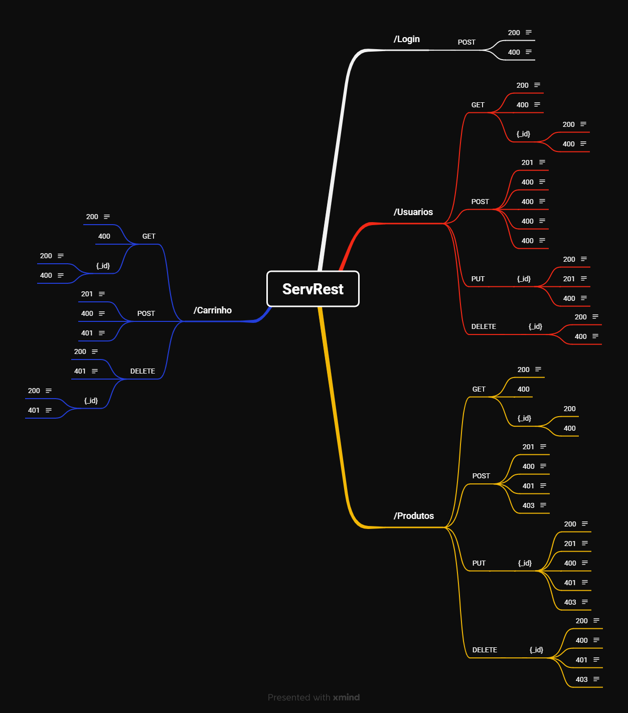

# Análise HTTP e API REST​

- API ServeRest utiliza uma documentação no estilo swagger separados por rotas 
contendo: o verbo http, o método, uma descrição (de limite de tempo de duração do token de 10 minutos),
contém um request, responses (exemplo login realizado com sucesso e outro de email e/ou senha inválidos)
- Devemos considerar o que está faltando na documentação (EX: senha em formato invalido, itens obrigatórios não preenchidos, itens inválidos)

## Criando mapa mental
- Ferramenta utilizada: Xmind
- Foi criado um mapa mental da API ServRest com o Xmind com criterios baseados na user stories da sprint e focando no endpoint /Usuarios.

    

