1) Crie uma requisição Get para validar o retorno de usuários através da API;

    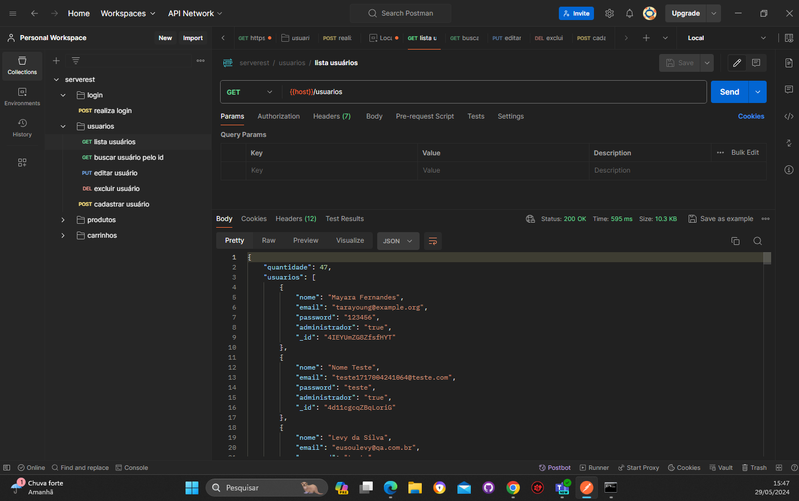

2) Crie uma requisição Post para cadastrar um novo usuário através da API;

    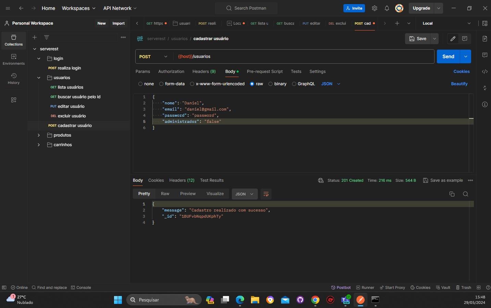

3) Crie uma requisição Get para validar o retorno de um usuário apenas através da API (pode utilizar os IDs dos usuários que vocês irão criar);
Identificando o id de usuário cadastrado.

    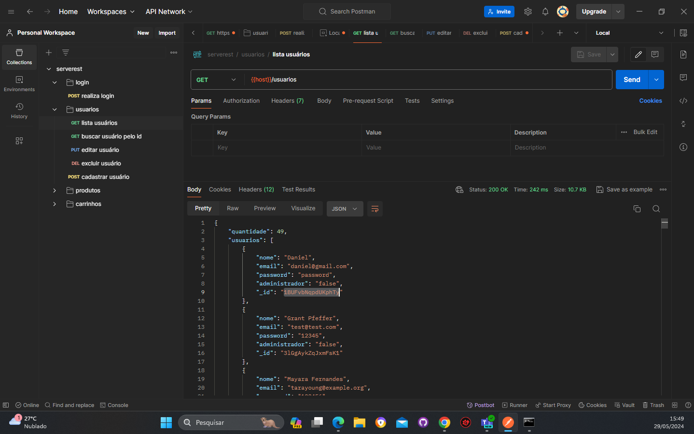

    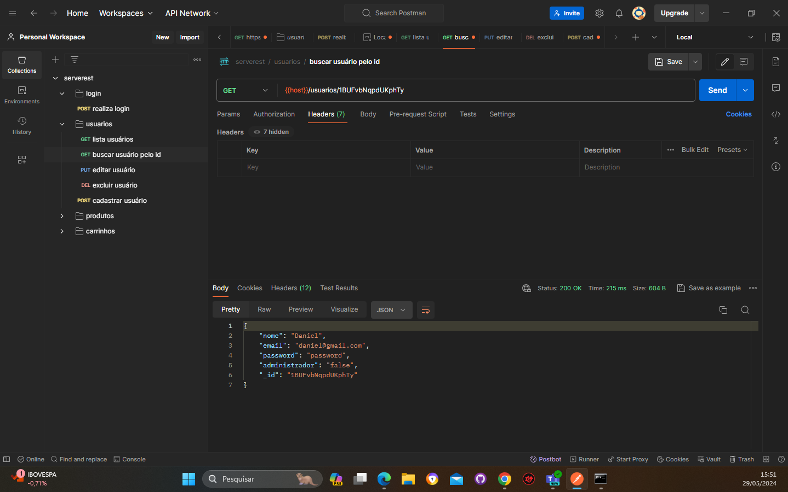

4) Crie cenários alternativos no cadastro de usuários, explore possíveis erros que podem ocorrer e mapeie as requisições através do Postman;

Com o campo nome vazio foi retornado o status 400:

    

Com o campo email vazio foi retornado o status 400:

    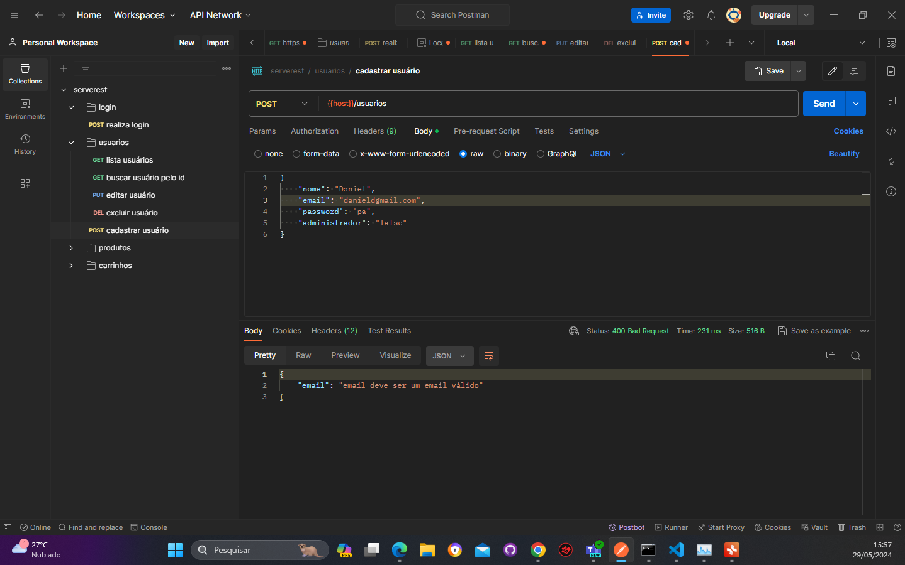

Com o campo senha vazio foi retornado o status 400:

    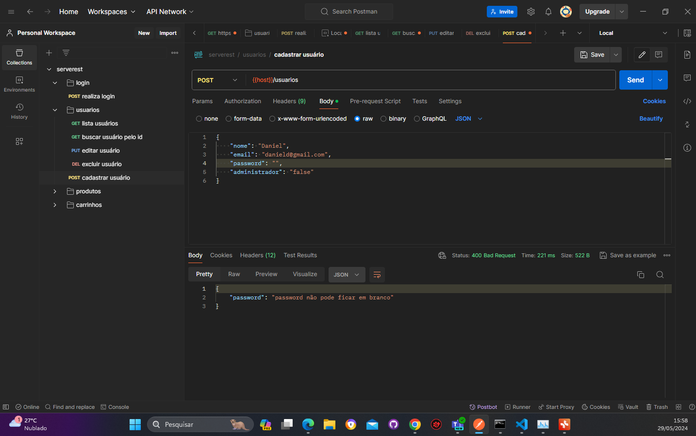

O cadastro com senha fraca foi permitido:

    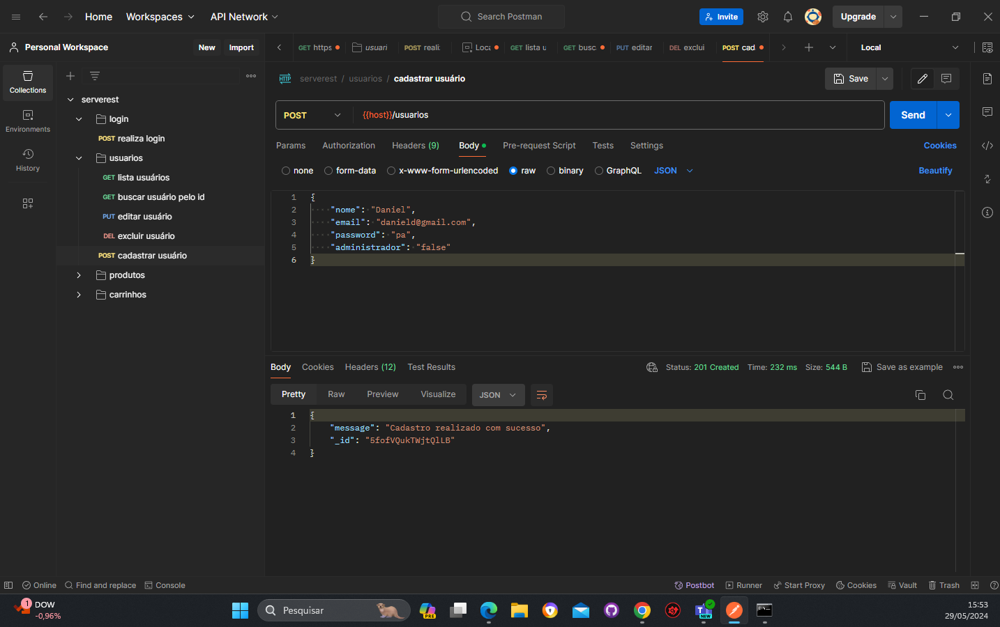

5) Crie cenários alternativos na atualização de usuários, explore possíveis erros que podem ocorrer e mapeie as requisições através do Postman;
Com o campo nome vazio foi retornado o status 400:

    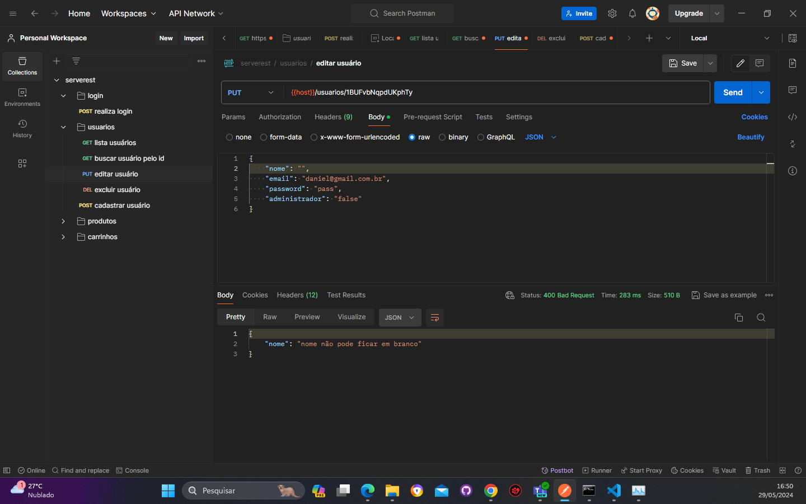

Com o campo email vazio foi retornado o status 400:

    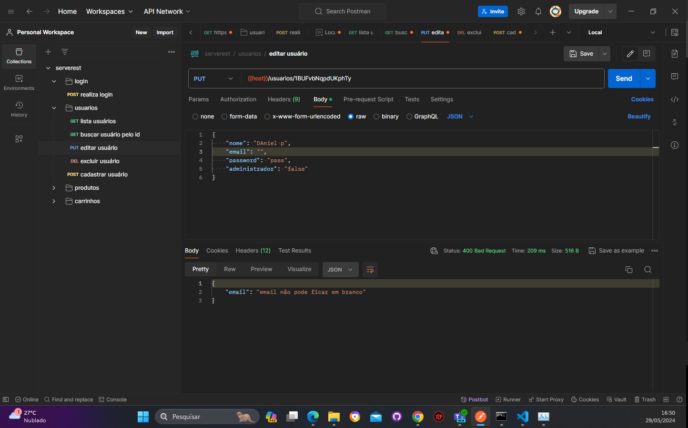

Com o campo senha vazio foi retornado o status 400:

    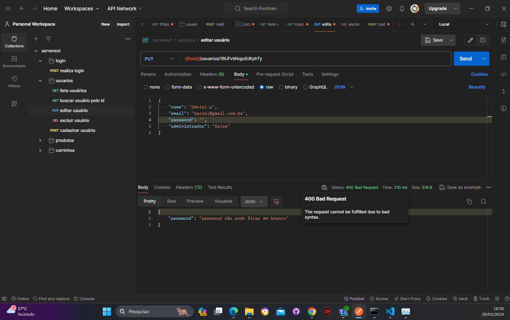

Com o campo email invalido foi retornado o status 400:

    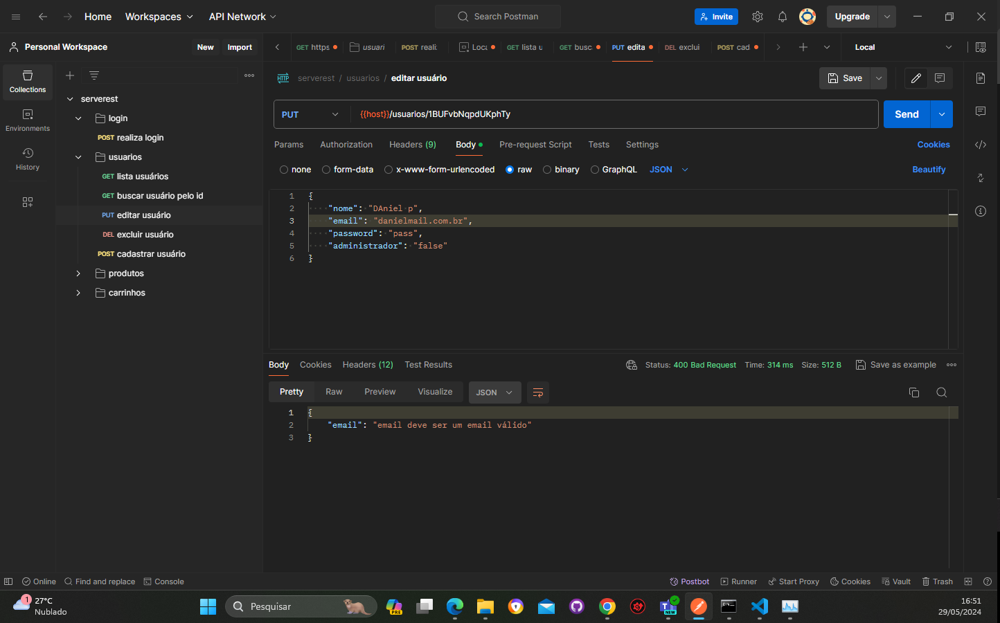

Novamente foi permitido atualização da senha fraca.

    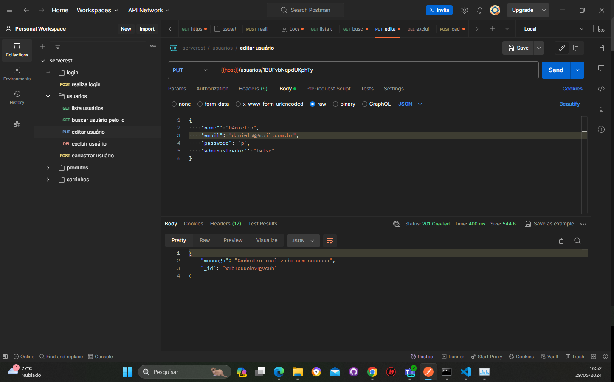

6) Crie cenários alternativos na exclusão de usuários, explore possíveis erros que podem ocorrer e mapeie as requisições através do Postman.
O usuário foi excluido mas aparece no response "Nenhum registro excluido":

    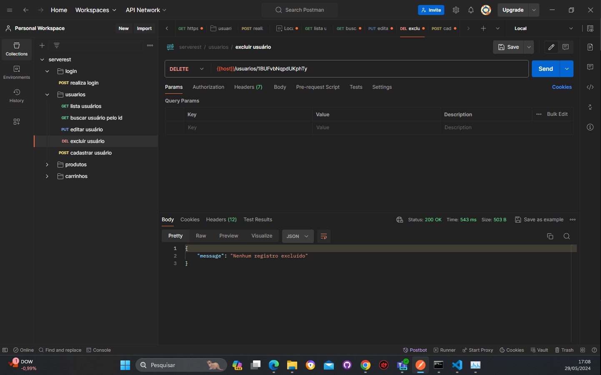

Confirmando se o usuario foi excluido, e foi confirmado:

    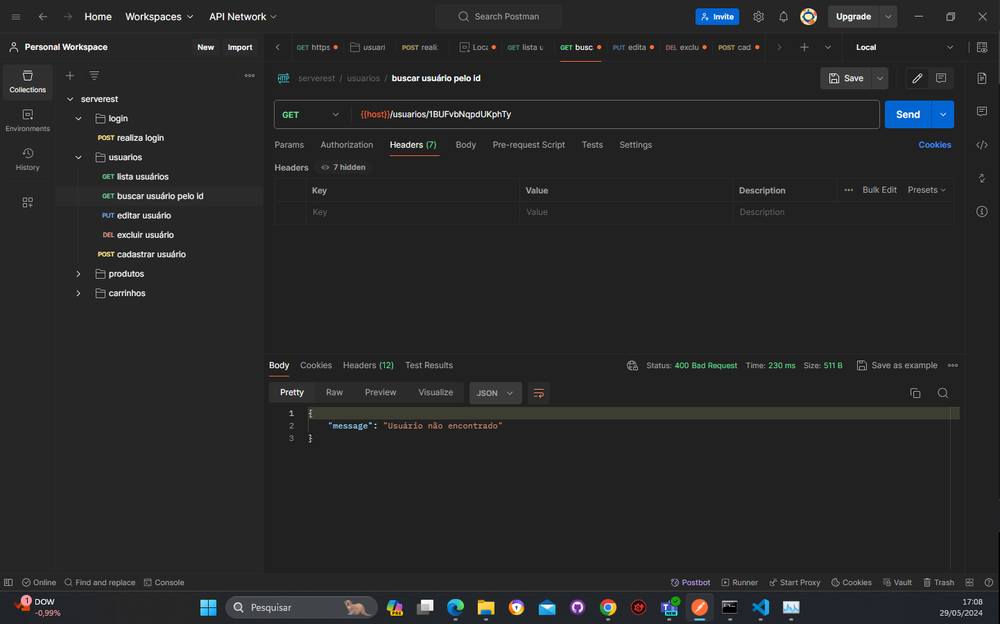

