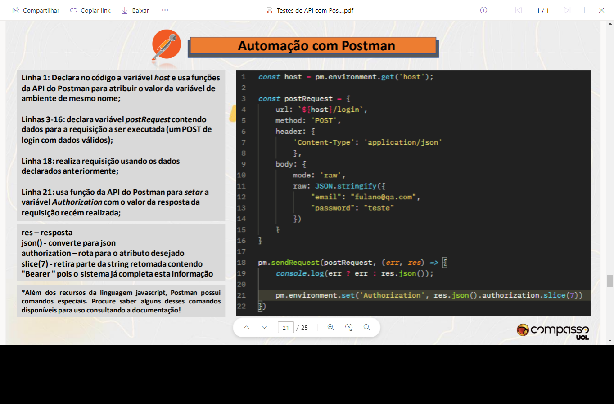

# Ferramentas para testes de api

## Postman
 - Basicamente este programa serve para testar a comunicação com APIs. 
- Utiliza de uma interface de fácil uso.
- Funcionalidades como run, testar e documentar.
- Dá a possibilidade de empacotar todos os seus requests e enviar
inclui também níveis de automação utilizando a biblioteca iuma
Permite a criação de collections para deixar mais organizado
Permite tornar a seleção dinâmica usando diferentes ambientes(environments).
- Para realizar as requisições pode ser necessário enviar dados em seu corpo (body), onde o formato para estrutura mas usada é o raw e o tipo poder Text, JavaScript, JSON, HTML, XML mas o mais usado é o JSON.
- Existe um campo de entrada de body e um campo de resposta
- No campo de autenticação selecionar o Basic Authentication e informar usuario e senha.
- Automação com Postman pode conter os seguintes itens:
    - Declaração e manipulação de variável;
    - Arrow functions.
    - Interpolação de strings.
    - Acesso a propriedade de elemento 
    JSON.
    - Assertions(biblioteca Chai).
    - Painel de resultados.
    - Correspondência entre nome do teste e 
    nome exibido no resultado.
    - Explicação de um codigo de automação de teste:

    

## Insominia 
- É uma ferramenta cliente de api rest , permite visualizar a resposta além do JSON, podendo ser possível ver arquivo de imagem , áudio e PDF.

## Ferramentas para testes automatizado
- REST-assured oferece suporte para validar o protocolo HTTP e requisições em JSON , validar as respostas das requisições.

- HTTParty permite realizar testes simples como status code, tempo de execução e verificar se regras de negócio funcionam como o especificado.

## Ferramentas para teste de carga
- Apache JMeter serve para fazer testes funcionais e medir o desempenho de aplicações.

- K6 é otimizado para consumir o mínimo de recurso do sistema e para realizar testes com altas cargas.
